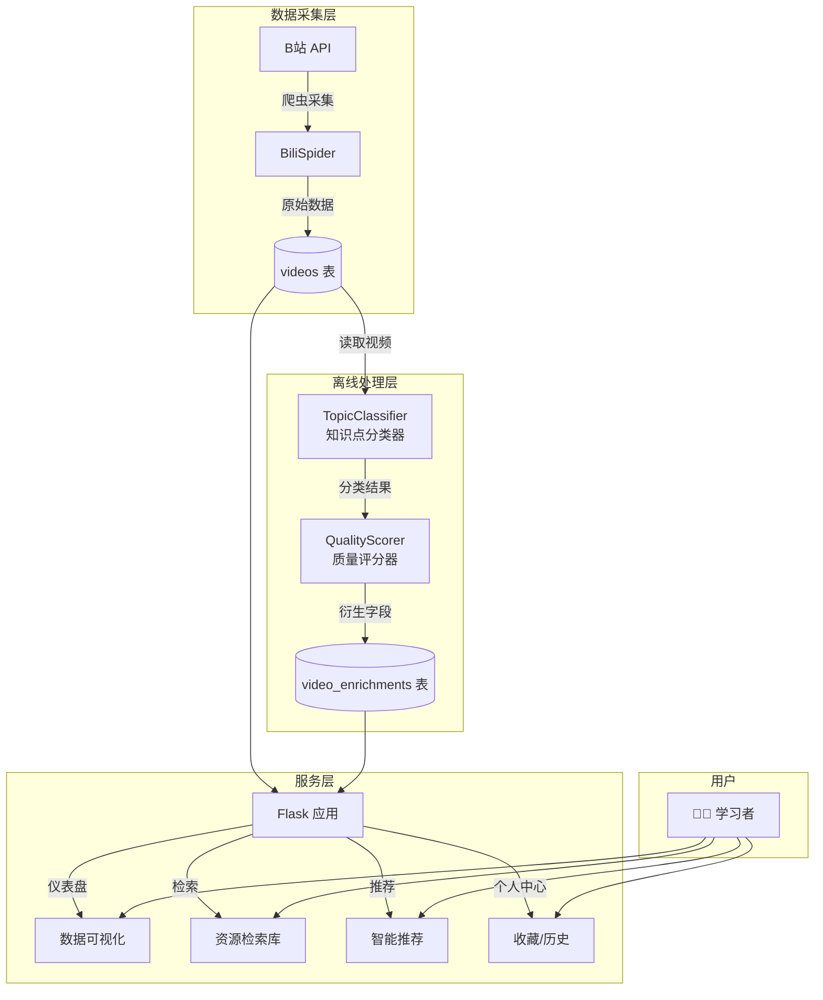
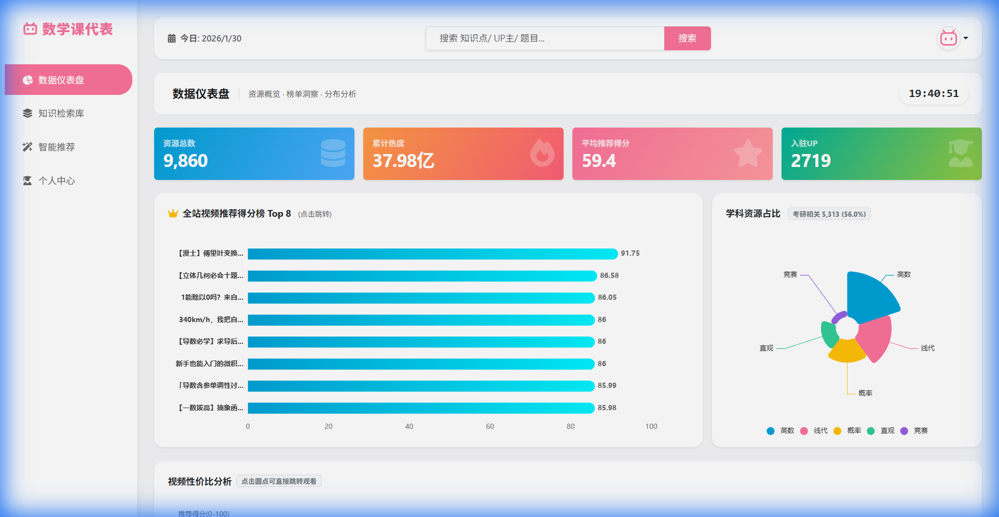
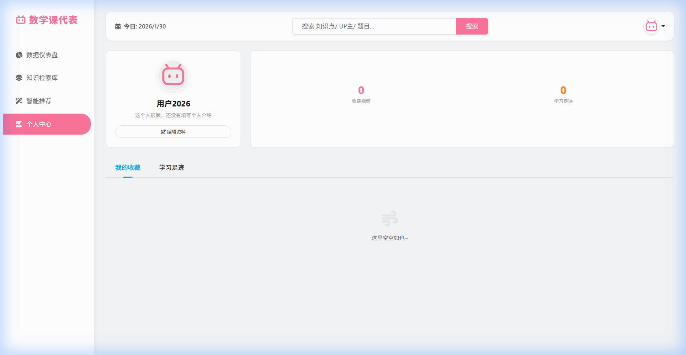

# 🎓 数学课代表

> **B站高等数学教学资源分析与推荐系统** —— 让优质数学视频触手可及

面向大学生的高等数学学习聚合平台，汇集 B 站热门课程与刷题视频，提供数据可视化、智能推荐和学习资产管理，帮你快速找到合适的老师、题库与复习路径。

---

## 📖 项目简介

「数学课代表」是一套完整的 **教学视频采集、分析与推荐系统**，专注于高等数学、线性代数、概率论与数理统计三大核心课程。系统通过爬虫从 B 站采集视频元数据，利用知识点分类器和质量评分器进行离线分析，最终呈现给用户一个直观、高效的学习资源检索与推荐平台。

### 核心价值

- 🔍 **一站式资源聚合**：汇集高数名师（宋浩、张宇、汤家凤等）的优质课程
- 📊 **数据驱动决策**：通过播放量、收藏率、质量分等多维度帮你筛选优质内容
- 🎯 **智能推荐**：基于知识点、难度、学习进度的个性化推荐
- 📈 **可视化分析**：仪表盘展示数据全貌，辅助学习规划

---

## 🛠 技术栈

| 领域 | 技术选型 |
|------|----------|
| **后端框架** | Flask 3.1 |
| **用户认证** | Flask-Login |
| **ORM** | Flask-SQLAlchemy + SQLAlchemy 2.0 |
| **数据库** | MySQL 8.0 (PyMySQL 驱动) |
| **图片处理** | Pillow |
| **数据采集** | requests + urllib3 (B站 API) |
| **前端** | Bootstrap 5 + ECharts + WordCloud |

---

## ⚡️ 系统架构与核心流程

系统采用 **采集-处理-服务** 三层架构，核心流程如下：



### 流程说明

1. **数据采集**：`BiliSpider` 按高等数学/线性代数/概率论关键词从 B 站 API 搜索并采集视频元数据，存入 `videos` 表
2. **离线处理**：`process_videos.py` 批量调用分类器和评分器，生成知识点、难度、质量分等衍生字段，存入 `video_enrichments` 表
3. **线上服务**：Flask 应用 JOIN 两表数据，提供仪表盘、资源检索、智能推荐、个人中心四大功能模块

---

## 🗄️ 数据库模型

系统采用 **主表 + 衍生表** 的分离设计，职责清晰：

### 表结构总览

| 表名 | 说明 | 主要字段 |
|------|------|----------|
| `videos` | 视频原始数据 | bvid, 标题, UP主, 播放量, 收藏数, 时长, 标签, 发布时间 |
| `video_enrichments` | 离线计算结果 | 科目, 知识点, 难度, 质量分, 是否推荐 |
| `users` | 用户信息 | 账号, 昵称, 密码哈希, 头像 |
| `user_actions` | 用户行为 | 用户ID, 视频ID, 行为类型(收藏/历史), 创建时间 |

### 设计意图

- **videos**：存储爬虫采集的原始字段，与 B 站保持一致，便于增量更新
- **video_enrichments**：存储离线计算的衍生字段，支持独立迭代分类算法和评分规则
- **一对一关联**：通过 `视频ID` 外键关联，查询时 JOIN 获取完整视频信息

---

## 🚀 快速开始

### 环境要求

- Python 3.10+
- MySQL 5.7 / 8.0
- 建议使用虚拟环境

### 安装步骤

```bash
# 1. 克隆项目
git clone https://github.com/your-repo/Bilibili_Math_System.git
cd Bilibili_Math_System

# 2. 创建虚拟环境
python -m venv .venv
.\.venv\Scripts\activate  # Windows
# source .venv/bin/activate  # Linux/Mac

# 3. 安装依赖
pip install -r requirements.txt

# 4. 配置数据库
# 修改 config.py 中的数据库连接串，或设置环境变量 SQLALCHEMY_DATABASE_URI
```

### 数据库初始化

**方式一：使用已有 SQL 文件（推荐）**

```bash
# 在 MySQL 中执行
mysql -u root -p bilibili_math_db < docs/migrations/bilibili_math_db.sql
```

**方式二：自动建表**

首次启动应用时会自动执行 `db.create_all()` 创建表结构。

### 启动应用

```bash
# 开发模式
flask --app app run --debug

# 访问
http://127.0.0.1:5000/
```

### 采集数据（可选）

```bash
# 配置 B 站 Cookie（在 .env 文件中）
echo "BILI_COOKIE=你的Cookie" > .env

# 运行爬虫
python spider/bilibili_api.py
```

### 离线处理（可选）

```bash
# 对已有视频进行知识点分类和质量评分
python -m core.process_videos
```

---

## 🧩 功能特性

### 📊 数据仪表盘

- **数据总览**：视频总量、播放量、平均收藏率
- **收藏率榜单**：TOP 10 高收藏率视频
- **学科分布图**：高数/线代/概率论分布玫瑰图
- **时长-干货度散点图**：快速定位高质量短视频

### 🔍 资源检索库

- **多维筛选**：按科目、知识点、难度筛选
- **智能排序**：收藏率/播放量/发布时间/质量分
- **全局搜索**：标题、标签、UP 主名称模糊匹配
- **分页浏览**：卡片式布局，一目了然

### 🎯 智能推荐

- **多策略推荐**：热门/最新/入门/进阶/高阶
- **知识点导航**：按课程-知识点层级筛选
- **个性化排序**：结合质量分和用户偏好

### 👤 个人中心

- **收藏管理**：一键收藏/取消收藏
- **学习足迹**：自动记录观看历史
- **个人资料**：昵称、头像、个人简介维护

### 📈 UP 主分析（仪表盘页）

- **雷达图对比**：传播指数/质量指数/热度指数/硬核度/活跃度
- **词云展示**：基于视频标签的真实词云

---

## 📁 目录结构

```
Bilibili_Math_System/
├── app.py               # Flask 入口：应用初始化与蓝图注册
├── app_routes.py        # 路由层：三蓝图（auth/pages/api）
├── app_services.py      # 服务层：通用业务函数
├── models.py            # ORM 模型定义
├── config.py            # 配置类
│
├── core/                # 核心算法模块
│   ├── topic_classifier.py   # 知识点分类器（关键词规则）
│   ├── quality_scorer.py     # 质量评分器（多维度加权）
│   ├── recommend_engine.py   # 推荐引擎（多策略）
│   └── process_videos.py     # 批处理脚本
│
├── spider/              # B站爬虫
│   ├── bilibili_api.py       # 爬虫主模块（BiliAPI + BiliSpider）
│   └── utils.py              # 工具函数
│
├── templates/           # Jinja2 模板
├── static/              # 静态资源
├── docs/                # 文档与迁移脚本
│   ├── migrations/           # SQL 迁移文件
│   └── screenshots/          # 页面截图
│
└── requirements.txt     # Python 依赖清单
```

---

## 📸 页面效果图

### 仪表盘（数据总览、分布图、散点图）



### 资源检索（多维筛选、排序、分页）


### 智能推荐（多策略、知识点导航）


### 个人中心（收藏、历史、头像维护）



---

## 📋 依赖说明

| 文件 | 说明 |
|------|------|
| `requirements.txt` | 运行时必备依赖 |
| `requirements-dev.txt` | 开发/测试依赖（pytest 等） |
| `requirements-ml.txt` | ML 扩展依赖（可选） |

---

## ⚠️ 开发提示

1. **敏感信息**：数据库凭据、SECRET_KEY、B 站 Cookie 请本地配置，勿提交仓库
2. **静态资源**：Bootstrap/ECharts/WordCloud 均使用本地 `static/` 目录，CDN 不可用时可运行 `python force_fix.py` 重新下载
3. **用户注册**：仅需用户名与密码，无额外校验

---

## 📄 License

MIT License - 详见 [LICENSE](LICENSE) 文件
